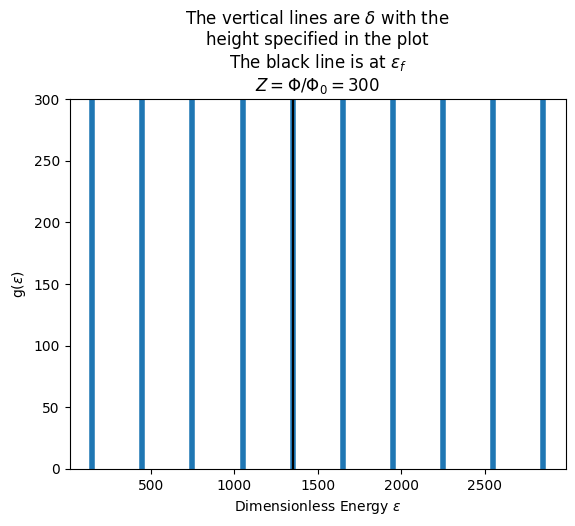

# Landau levels
Some functions that plot, on the same canvas, both the density of states and the fermi level for
-2D system of (spinless) electrons in a _square_ with an othogonal uniform magnetic field
-3D system of (spinless) electrons in a _box_($L_x=L_y=L_z$) with a uniform magnetic field in the $z$ direction

Even though the landau levels' energies depend on the magnetic field $B$ and the area of the sheet (or the cross section in 3D) separately, we choose to normalize
the energy $\epsilon$ in such a way that it becomes dimensionless and the landau levels depend only on the flux of the $B$ field:
$$\tilde{\epsilon}_{n,n_z}= Z(\frac12 + n)+\pi n_z^2$$
where $Z=\frac{\Phi}{\Phi_0}$ is the number of quantum fluxes that pass through the system.\\
So the normalized landau levels are dimensionless and depend just on the flux $\Phi$.

## Visualization of $g(\epsilon)$ and $\epsilon_f$
### "plot_density2D(Z,n_max)" or "plot_density3D(Z,n_max)"
Plots the densiy of states $g(\epsilon)$ as a function of the normalized _dimensionless energy_ $\tilde{\epsilon}$, for a system
with $Z$ quantums of magnetic flux, until the energy of the $n_{max}$-th energy level.
#### 2D function
In 2D all the energy levels have the same degeneracy. If you want $g(\epsilon)$ to be a function which integrated over an energy interval gives
the number of states with energy in that interval, $g(\epsilon)$ must be a sum of $\delta(\epsilon-\epsilon_n)$, where the height of each $\delta$
is the degeneracy of the level $\epsilon_n$.\\\
In order to represent those $\delta$, the function "*plot_density2D*" plots vertical lines with an height that coincides with the degeneracy of the level.\\\
*Note*:The height of the vertical lines is the maximum value of the $y$ coordinate reported on the $y$ axis!

#### 3D function
In 3D the function $g(\epsilon)$ is a continuos function _only if_ the lenght of the box in the $z$ direction is infinite, otherwise the energy levels are still discrete. Here we deal with electrons in a box, so the system cannot be considered infinite in the $z$ direction and so if we define $g(\epsilon)=dN/d\epsilon$ the denominator $d\epsilon$ shall be _non-infinitesimal_, otherwise in that infinitesimal energy interval there would be no states!\\\
The function *plot_density3D* calculates the function $g(\epsilon)=dN/d\epsilon$ in this way:
- the function is evalueted only in the landau levels ($\epsilon = \epsilon_n)
- dN is the number of states in the (n+1)-th level
- $d\epsilon = \epsilon_{n+1}-\epsilon_{n}$
we choose this way of calculating $g(\epsilon)$ because it considers the minimum possible values of $d\epsilon$ for which the corresponding $dN$ values are not zero.

### "plot_fermi_over_density2D(Z,N,n_max)" or "plot_fermi_over_density3D(Z,N,n_max)"
Plots the density of states $g(\epsilon)$ and _on the same canvas_ the fermi level for a system with $Z$ quantums of magnetic flux and $N$ electrons.\\\
The fermi level is calculated by filling the avaible states from the lowest in energy, until all electrons have been placed in the states.
